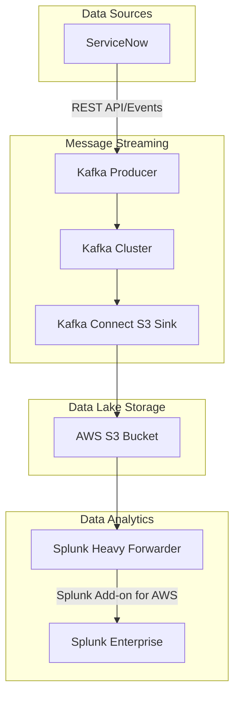

# ServiceNow to Splunk Data Pipeline via Kafka and AWS S3

## Overview

This document outlines the architecture and implementation approach for streaming data from ServiceNow through Apache Kafka to AWS S3, and finally to Splunk Enterprise using Splunk Heavy Forwarder and the Splunk Add-on for AWS.

## High-Level Architecture



## Data Flow Components

### 1. ServiceNow Integration

**Purpose**: Extract data from ServiceNow and publish to Kafka topics

**Implementation Options**:
- **REST API Polling**: Scheduled data extraction using ServiceNow REST API
- **Event-Driven**: ServiceNow Business Rules trigger events to Kafka
- **Table API**: Direct table data extraction for bulk operations

**Key Considerations**:
- Authentication (OAuth 2.0 or Basic Auth)
- Rate limiting and API throttling
- Data filtering and field selection
- Incremental data extraction using sys_updated_on

### 2. Kafka Producer Configuration

**Purpose**: Publish ServiceNow data to Kafka topics with high reliability

**Configuration**:
```properties
# Producer Configuration
bootstrap.servers=kafka-cluster:9092
key.serializer=org.apache.kafka.common.serialization.StringSerializer
value.serializer=org.apache.kafka.common.serialization.JsonSerializer
acks=all
retries=2147483647
max.in.flight.requests.per.connection=5
enable.idempotence=true
compression.type=snappy
```

**Topics Structure**:
- `servicenow.incidents`
- `servicenow.change_requests`
- `servicenow.tasks`
- `servicenow.users`

### 3. Kafka Cluster

**Purpose**: Reliable message streaming and buffering

**Configuration**:
- **Replication Factor**: 3 (for production)
- **Partitions**: Based on throughput requirements
- **Retention**: 7 days (configurable based on recovery needs)
- **Compression**: Snappy or LZ4

**Topics Configuration**:
```properties
# Topic Configuration
num.partitions=6
default.replication.factor=3
min.insync.replicas=2
cleanup.policy=delete
retention.ms=604800000
compression.type=producer
```

### 4. Kafka Connect S3 Sink

**Purpose**: Stream data from Kafka topics to AWS S3 buckets

**Connector Configuration**:
```json
{
  "name": "s3-sink-servicenow",
  "config": {
    "connector.class": "io.confluent.connect.s3.S3SinkConnector",
    "tasks.max": "3",
    "topics": "servicenow.incidents,servicenow.change_requests,servicenow.tasks",
    "s3.bucket.name": "servicenow-data-lake",
    "s3.region": "us-east-1",
    "flush.size": "1000",
    "rotate.interval.ms": "300000",
    "rotate.schedule.interval.ms": "3600000",
    "timezone": "UTC",
    "partition.duration.ms": "3600000",
    "path.format": "'year'=YYYY/'month'=MM/'day'=dd/'hour'=HH",
    "locale": "en",
    "partitioner.class": "io.confluent.connect.storage.partitioner.TimeBasedPartitioner",
    "storage.class": "io.confluent.connect.s3.storage.S3Storage",
    "format.class": "io.confluent.connect.s3.format.json.JsonFormat",
    "schema.compatibility": "NONE"
  }
}
```

**S3 Bucket Structure**:
```
s3://servicenow-data-lake/
├── topics/
│   ├── servicenow.incidents/
│   │   ├── year=2024/month=01/day=15/hour=14/
│   │   │   └── servicenow.incidents+0+0000000000.json
│   ├── servicenow.change_requests/
│   └── servicenow.tasks/
```

### 5. AWS S3 Configuration

**Purpose**: Centralized data lake for ServiceNow data with proper governance

**Bucket Configuration**:
- **Versioning**: Enabled
- **Encryption**: AES-256 or KMS
- **Lifecycle Policies**: Transition to IA/Glacier based on retention requirements
- **Access Logging**: Enabled for audit trails

**IAM Permissions**:
```json
{
  "Version": "2012-10-17",
  "Statement": [
    {
      "Effect": "Allow",
      "Principal": {
        "AWS": "arn:aws:iam::ACCOUNT:user/kafka-connect-s3"
      },
      "Action": [
        "s3:PutObject",
        "s3:PutObjectAcl",
        "s3:GetObject",
        "s3:DeleteObject",
        "s3:ListBucket"
      ],
      "Resource": [
        "arn:aws:s3:::servicenow-data-lake",
        "arn:aws:s3:::servicenow-data-lake/*"
      ]
    }
  ]
}
```

### 6. Splunk Heavy Forwarder Setup

**Purpose**: Pull data from S3 and forward to Splunk Enterprise

**Installation Steps**:
1. Install Splunk Heavy Forwarder on EC2 instance in same AWS region
2. Install Splunk Add-on for AWS
3. Configure AWS credentials and S3 inputs

**Heavy Forwarder Configuration**:
```ini
# outputs.conf
[tcpout]
defaultGroup = splunk_indexers

[tcpout:splunk_indexers]
server = splunk-indexer1:9997, splunk-indexer2:9997
compressed = true
useACK = true

# inputs.conf (managed by AWS Add-on)
[aws_s3]
disabled = false
```

### 7. Splunk Add-on for AWS Configuration

**Purpose**: Native integration between Splunk and AWS services

**AWS Add-on Setup**:

1. **Account Configuration**:
   - AWS Access Key ID and Secret Access Key
   - Or IAM Role with appropriate S3 permissions
   - Region: us-east-1

2. **S3 Input Configuration**:
```ini
[aws_s3://servicenow_incidents]
aws_account = servicenow-account
bucket_name = servicenow-data-lake
key_name = topics/servicenow.incidents/
recursively_scan_bucket = true
character_set = UTF-8
sourcetype = servicenow:incident
index = servicenow
host_name = servicenow-kafka-pipeline
interval = 300
parse_csv_with_header = false
```

3. **Data Parsing Configuration**:
```ini
# props.conf
[servicenow:incident]
SHOULD_LINEMERGE = false
LINE_BREAKER = ([\r\n]+)
category = Operating System
description = ServiceNow Incidents from Kafka/S3 Pipeline
KV_MODE = json
AUTO_KV_JSON = true
TRUNCATE = 10000
TIME_PREFIX = "sys_updated_on":"
TIME_FORMAT = %Y-%m-%d %H:%M:%S
TIMESTAMP_FIELDS = sys_updated_on
```

## Implementation Timeline

### Phase 1: Infrastructure Setup (2-3 weeks)
- Set up Kafka cluster with proper configuration
- Configure AWS S3 bucket with appropriate permissions
- Install and configure Kafka Connect with S3 sink connector

### Phase 2: ServiceNow Integration (1-2 weeks)
- Develop Kafka producer for ServiceNow data extraction
- Implement authentication and error handling
- Set up monitoring and alerting

### Phase 3: Splunk Integration (1-2 weeks)
- Install Splunk Heavy Forwarder and AWS Add-on
- Configure S3 inputs and data parsing
- Validate data flow and create dashboards

### Phase 4: Testing and Optimization (1 week)
- End-to-end testing with sample data
- Performance tuning and optimization
- Documentation and knowledge transfer

## Monitoring and Alerting

### Kafka Monitoring
- Topic lag monitoring
- Consumer group health
- Broker performance metrics

### S3 Monitoring
- Object creation rates
- Storage costs
- Access patterns

### Splunk Monitoring
- Data ingestion rates
- Heavy Forwarder health
- Index storage utilization

## Security Considerations

1. **Network Security**:
   - VPC configuration with private subnets
   - Security groups with minimal required access
   - SSL/TLS encryption for all communications

2. **Authentication & Authorization**:
   - ServiceNow OAuth 2.0 integration
   - AWS IAM roles with least privilege
   - Splunk RBAC implementation

3. **Data Protection**:
   - Encryption at rest (S3, Kafka)
   - Encryption in transit (TLS 1.2+)
   - Data masking for sensitive fields

## Cost Optimization

1. **S3 Storage**:
   - Implement lifecycle policies for archival
   - Use appropriate storage classes
   - Monitor and optimize data retention

2. **Compute Resources**:
   - Right-size Kafka cluster and Heavy Forwarder instances
   - Use spot instances where appropriate
   - Implement auto-scaling for variable loads

3. **Data Transfer**:
   - Minimize cross-region transfers
   - Use VPC endpoints for S3 access
   - Implement data compression

## Troubleshooting Guide

### Common Issues

1. **Kafka Connect Failures**:
   - Check S3 permissions
   - Verify network connectivity
   - Monitor connector logs

2. **Splunk Ingestion Issues**:
   - Validate AWS Add-on configuration
   - Check S3 bucket permissions
   - Review data parsing configuration

3. **Performance Issues**:
   - Monitor Kafka lag
   - Check S3 request rates
   - Analyze Splunk indexing performance

## Best Practices

1. **Data Quality**:
   - Implement data validation in Kafka producers
   - Monitor for schema changes
   - Set up data quality alerts

2. **Scalability**:
   - Design for horizontal scaling
   - Implement proper partitioning strategies
   - Monitor resource utilization

3. **Disaster Recovery**:
   - Implement cross-region replication
   - Regular backup and restore testing
   - Document recovery procedures
